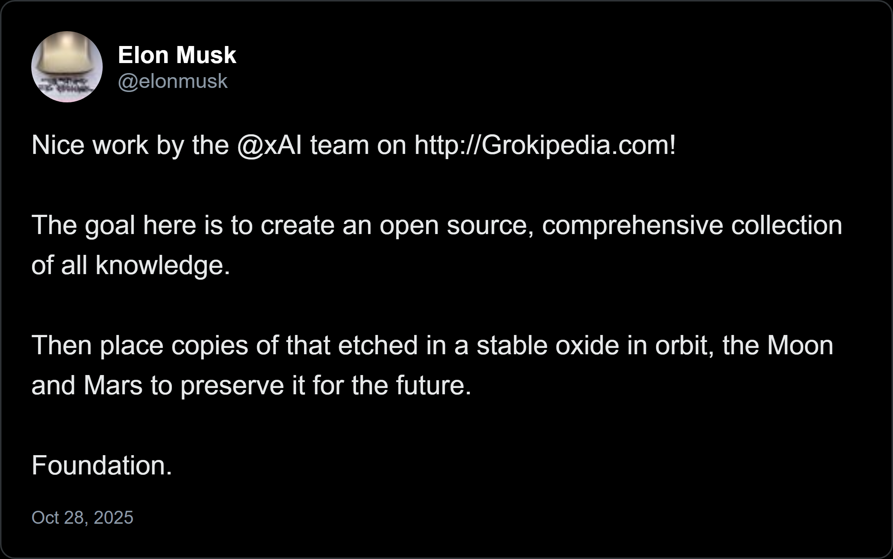
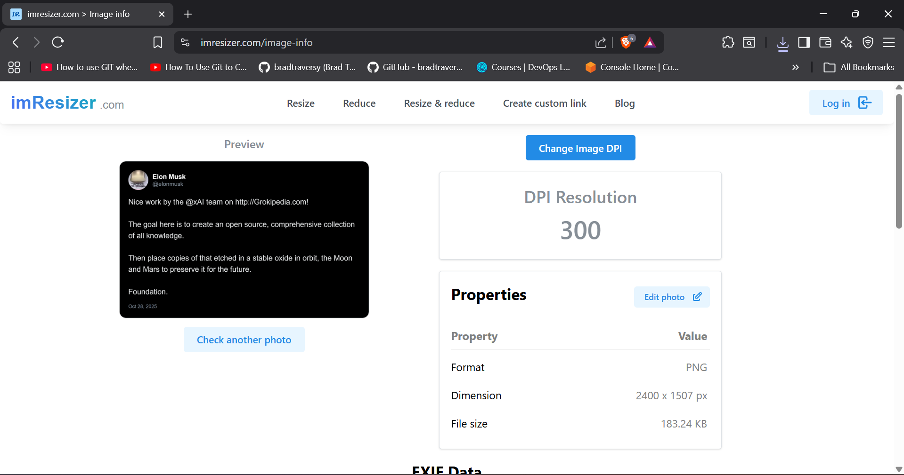
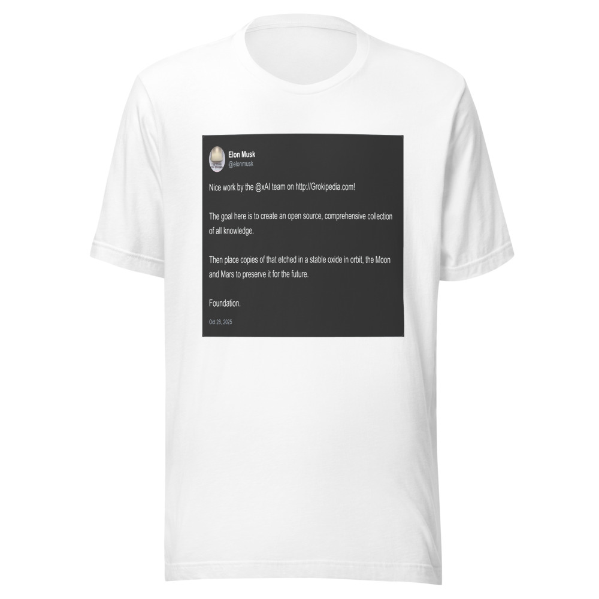

# Tweet Shirt App — README (Updated: Printful & Cloudinary)

> **Status:** Updated to reflect Printful's modern mockup & file APIs, Cloudinary upload flow, improved image DPI handling, and new 300 DPI proof images.

---

## Table of Contents

1. Project Overview
2. Printful + Cloudinary Updates
3. Screenshots
4. Cloudinary & Printful Integration Details
5. Services & Files Overview
6. Environment Variables (.env example)
7. How to Run (Local Dev)
8. API Endpoints
9. Configuration
10. Technologies
11. Troubleshooting & Tips

---

## 1. Project Overview

**Tweet Shirt App** is a full-stack application that lets users paste tweet URLs (X.com) and turn the tweet into a high-resolution printable design for custom t-shirts. The backend renders a tweet image, uploads it to Cloudinary, registers the file with Printful, generates product mockups using Printful's mockup generator, and returns mockup preview URLs to the frontend.

Key features:
- Paste tweet URL → fetch tweet data → render high-resolution tweet image (300 DPI)
- Upload rendered artwork to Cloudinary for CDN + signed URL
- Register artwork in Printful File Library
- Generate mockups using Printful's Mockup Generator API (create-task + poll)
- Preview mockups on frontend; optionally place orders via Printful orders API
- Fabric.js-based canvas editing and export

---

## 2. Printful + Cloudinary Updates

### Printful API Updates
- **File uploads:** Use `POST https://api.printful.com/files` with `{ url: '<cloudinary_url>' }` to add files to Printful's file library.
- **Mockup generator:** Use the asynchronous task-based approach (`create-task` → poll `task`).
- **Orders:** Created via `POST https://api.printful.com/orders` with registered file IDs or image URLs.

### Cloudinary Integration
- Used for image hosting, fast CDN delivery, and secure print-ready file management.
- Each rendered image (300 DPI) is uploaded and linked to Printful.

---


## 3. Screenshots


*Main application interface - Tweet input and t-shirt preview*


*Twitter API fetch Response*


*300 DPI Rendered Printfile*


*Proof Screenshot showing verified 300 DPI quality*


*Mockup Image Generated by Printful*

---

## 4. Cloudinary & Printful Integration Details

**Workflow Summary:**
1. Render tweet design → create 300 DPI PNG using `imageRenderer.js`
2. Upload to Cloudinary → get secure CDN URL
3. Register on Printful → `POST /files`
4. Generate Mockup → `create-task/{product_id}` → poll until completed
5. Return mockup URLs to frontend for preview

**Benefits of Cloudinary:**
- Global CDN and optimized delivery
- Secure file hosting for Printful
- Auto format & quality adjustments

**Benefits of Printful Integration:**
- Automated mockup generation
- Production-ready files
- Optional automated order creation

---

## 5. Services & Files Overview

| File | Description |
|------|-------------|
| `backend/server.js` | Express server entry, routes mounting, and CORS setup |
| `backend/routes/tweet.js` | Tweet endpoints (`/api/tweet/preview`) |
| `backend/routes/printful.js` | Printful mockup generation endpoints |
| `backend/controllers/tweetController.js` | Fetches and processes tweet data |
| `backend/controllers/printfulController.js` | Handles Cloudinary upload, Printful registration, and mockup generation |
| `backend/services/imageRenderer.js` | Creates print-ready images (300 DPI) |
| `backend/services/twitterAPI.js` | Fetches tweet content from VxTwitter or X API |
| `frontend/src/App.jsx` | React UI: tweet input, t-shirt preview, canvas editing |

---

## 6. Environment Variables (.env.example)

```env
# Server Configuration
PORT=3001
NODE_ENV=development

# Twitter API
VXTWITTER_API=https://api.vxtwitter.com

# Cloudinary Configuration
CLOUDINARY_CLOUD_NAME=placeholder
CLOUDINARY_API_KEY=placeholder
CLOUDINARY_API_SECRET=placeholder

# Printful Configuration
PRINTFUL_API_KEY=placeholder
PRINTFUL_STORE_ID=placeholder
```

> **Note:** Keep your `.env` out of version control.

---

## 7. How to Run (Local Dev)

```bash
# Backend
cd backend
npm install
npm run dev

# Frontend
cd frontend
npm install
npm start
```

Then visit:
- Backend: `http://localhost:3001`
- Frontend: `http://localhost:3000`

---

## 8. API Endpoints

- `GET /health` - Server health check
- `POST /api/tweet/preview` - Fetch tweet data and generate preview

---

## 9. Configuration

### Changing Backend API URL

If deploying to a different server, update the endpoint in `frontend/src/App.jsx`:

Find line 161:
```javascript
const response = await fetch('http://localhost:3001/api/tweet/preview', {
```

Replace with your backend URL:
- Local: `http://localhost:3001`
- Production: `https://your-domain.com`
- Shopify: `https://your-store.myshopify.com`

---

## 10. Technologies

**Backend:**
- Express.js
- Axios
- Dotenv
- CORS
- Nodemon (dev)

**Frontend:**
- React 19.2.0
- Axios
- Fabric.js
- Lucide React (icons)

---

## 11. Troubleshooting & Tips

- **Mockup Empty:** Ensure Cloudinary image URL is public.
- **300 DPI Validation:** Verify `sharp.withMetadata({ density: 300 })` is used in `imageRenderer.js`.
- **CORS Errors:** Adjust CORS origins in `server.js`.
- **Printful Errors:** Log entire Printful API responses for insight.
- **File Size:** Maintain high DPI but optimize PNGs.

---

**End of README**

