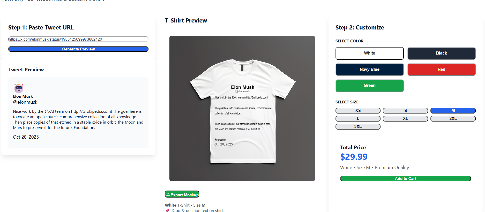
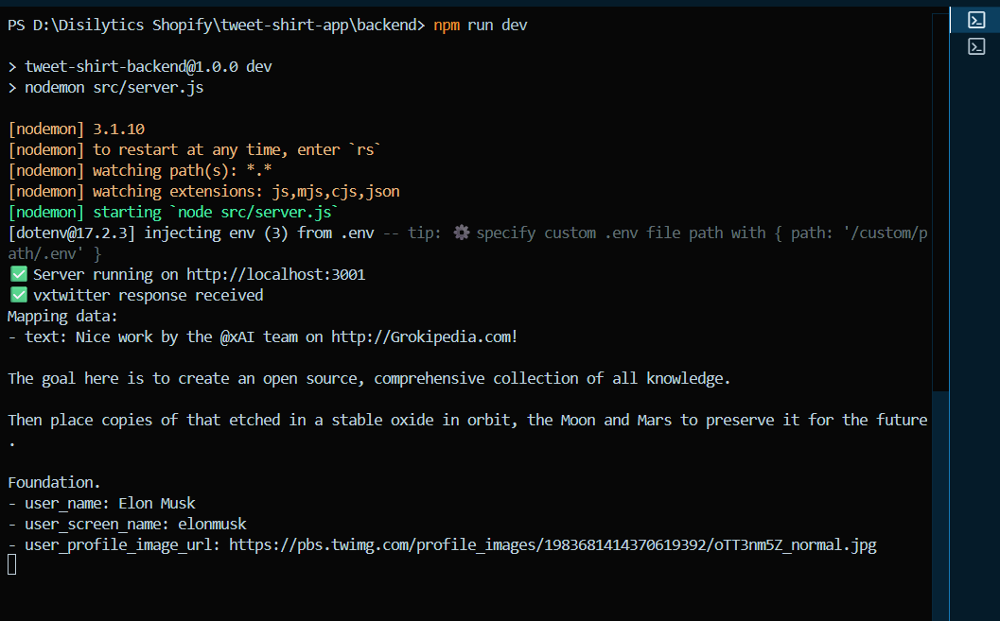

# Tweet Shirt App

A full-stack application that allows users to create custom t-shirts with tweet designs. Users can paste tweet URLs, preview tweets on different colored t-shirts, customize sizes, and download their designs.

## Project Structure

```
tweet-shirt-app/
├── backend/            # Node.js/Express server
├── docs/screenshots    #Snapshots of API fetch and Interface for testing
└── frontend/           # React application
```

## Prerequisites

- Node.js (v14 or higher)
- npm or yarn

## Installation & Setup

### Backend Setup

1. Navigate to backend directory:
   ```bash
   cd backend
   ```

2. Install dependencies:
   ```bash
   npm install
   ```

3. Create `.env` file in backend root:
   ```
   PORT=3001
   VXTWITTER_API=https://api.vxtwitter.com
   NODE_ENV=development
   ```

4. Start development server:
   ```bash
   npm run dev
   ```
   
   Or production:
   ```bash
   npm start
   ```

Backend runs at: `http://localhost:3001`

---

### Frontend Setup

1. Navigate to frontend directory:
   ```bash
   cd frontend
   ```

2. Install dependencies:
   ```bash
   npm install
   ```

3. Start development server:
   ```bash
   npm start
   ```

Frontend runs at: `http://localhost:3000`

---

## Running the Full Application

**Terminal 1 - Start Backend:**
```bash
cd backend
npm run dev
```

**Terminal 2 - Start Frontend:**
```bash
cd frontend
npm start
```

## Features

- **Tweet Input**: Paste tweet URLs in format: `https://x.com/username/status/1234567890`
- **Preview**: View tweet design on t-shirt
- **Customization**: 
  - Colors: White, Black, Navy Blue, Red, Green
  - Sizes: XS, S, M, L, XL, 2XL, 3XL
- **Canvas Editing**: Edit designs using Fabric.js
- **Download**: Export custom t-shirt designs

## Screenshots


*Main application interface - Tweet input and t-shirt preview*


*Twitter API fetch Response *

## API Endpoints

- `GET /health` - Server health check
- `POST /api/tweet/preview` - Fetch tweet data and generate preview

## Configuration

### Changing Backend API URL

If deploying to a different server, update the endpoint in `frontend/src/App.jsx`:

Find line 161:
```javascript
const response = await fetch('http://localhost:3001/api/tweet/preview', {
```

Replace with your backend URL:
- Local: `http://localhost:3001`
- Production: `https://your-domain.com`
- Shopify: `https://your-store.myshopify.com`

## Technologies

**Backend:**
- Express.js
- Axios
- Dotenv
- CORS
- Nodemon (dev)

**Frontend:**
- React 19.2.0
- Axios
- Fabric.js
- Lucide React (icons)

## Troubleshooting

- **API Connection Error**: Ensure backend is running on port 3001
- **Tweet Not Loading**: Verify URL format is correct and tweet exists
- **CORS Issues**: Check backend CORS configuration in server.js
